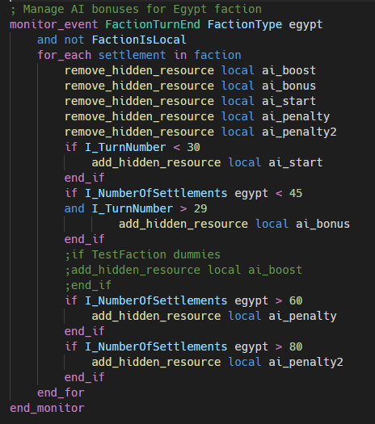
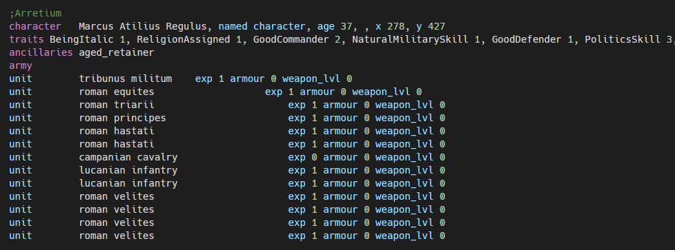
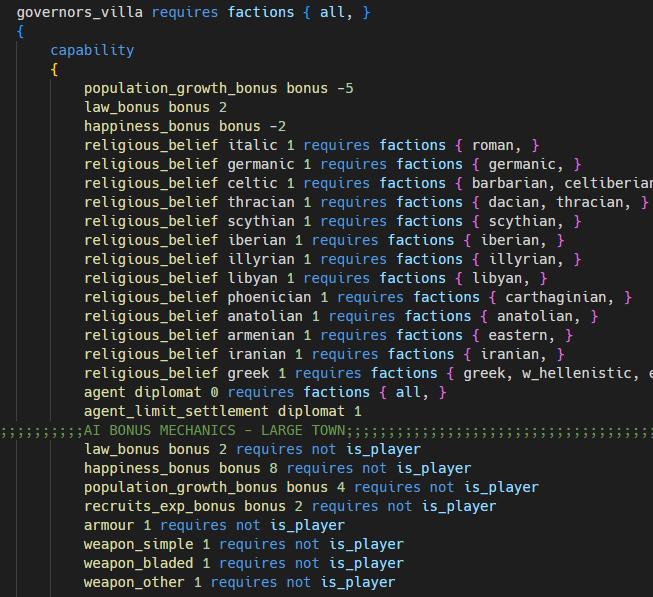

# Total War Script Highlighting

Adds support for syntax highlighting of the scripting language / data used in Rome Total War.  
Supported files at this momment are:  

1. Campaign Scripts (inside descr_strat.txt or standalone)
2. Data in descr_strat.txt
3. Data in export_descr_buildings.txt

scripts:  
  

descr_strat.txt:

export_descr_buildings.txt:

# Known Issues

If you are using scripts inside descr_strat.txt (like vanilla)
and not a separate campaign script file then to get correct script
highlighting you must enter ";#script" above the "script" keyword. That
will activate highlighting for scripts inside descr_strat.txt
